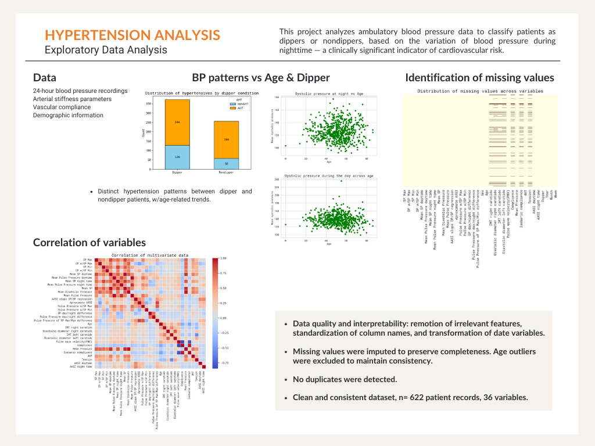

## Hypertension
# A multivariate study of ambulatory factors associated with hypertension in adults

**Clinical background**

Arterial hypertension (high blood pressure) is a major risk factor for cardiovascular, cerebrovascular, and kidney diseases. Blood pressure (BP) follows a regulated 24-hour cycle influenced by both external factors (e.g., activity, stress, posture) and internal circadian rhythms.

In healthy individuals, nighttime BP typically drops by ≥10% compared to daytime levels. These individuals are classified as dippers. In contrast, those with little or no nighttime BP reduction are known as nondippers—a clinically relevant condition linked to increased risk of organ damage and reduced cardiovascular and kidney function.

This project analyzes ambulatory blood pressure data to classify patients as dippers or nondippers, based on the variation of blood pressure during nighttime — a clinically significant indicator of cardiovascular risk.

**Context**

The dataset comes from the Unit of Preventive Medicine at a public hospital in Paris, France, and includes:

- 24-hour blood pressure recordings
- Arterial stiffness parameters (e.g., Pulse Wave Velocity, AASI)
- Vascular compliance
- Demographic information

**Goal**

The main objective is to explore circadian blood pressure patterns and develop a classification model to identify patients at higher cardiovascular risk due to a nondipper profile.

**Tools & Technologies**

- Python (Google Colab)
- pandas & numpy for data manipulation
- matplotlib for visualization
- scikit-learn for preprocessing and machine learning

